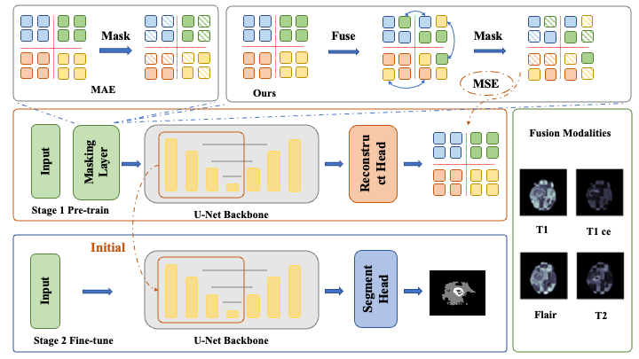

# Self-Supervised Learning via Reconstructing Multi-Modality MRI for Brain Tumor Segmentation
This repository contains the code for our self-supervised pre-training method for brain tumor segmentation. Our code is built on nnUNet, please install nnUNet correctly first and plug our code in follow the installation guide.


## Dataset
BraTS 2020 [[homepage]](https://www.med.upenn.edu/cbica/brats2020/data.html) is used in this work for pretraining and funetuning. 

## Installation
1. **System requirements：**  
We run our code on Python 3.9, PyTorch 1.12.1, CUDA 11.6.0, and cudann 8.4.1.50. Besides software packages required in [nnUNet project](https://github.com/MIC-DKFZ/nnUNet), install **monai** and **SimpleITK**:
```
  pip install monai
  pip install SimpleITK
```
2. **Setting up the repository：**  
You need plug our code in [nnUNet project](https://github.com/MIC-DKFZ/nnUNet) 
+ Add network_architecture into nnUNet/nnunet/network_architecture
+ Add run into  nnUNet/nnunet/run
+ Add training/network_training into nnUNet/nnunet/training/networkd_training

## Pretraining
Pretraining with UNet automatic searched by nnUNet
```
  python <~/nnUNet/nnunet/runtraining_mim.py> 3d_fullres mimTrainer <Task> <Fold> -mr <mask ratio> -mt <mask type> -ms <mask size> --lt <predict/reconstruct> --synthesize <True/False>
```

## Finetuning
Finetuning the pretrained model
```
  python  <~/nnUNet/nnunet/run/run_training_finetune.py> 3d_fullres finetuneV2 1 all -pre */model_best.pth -ft encoder
```
